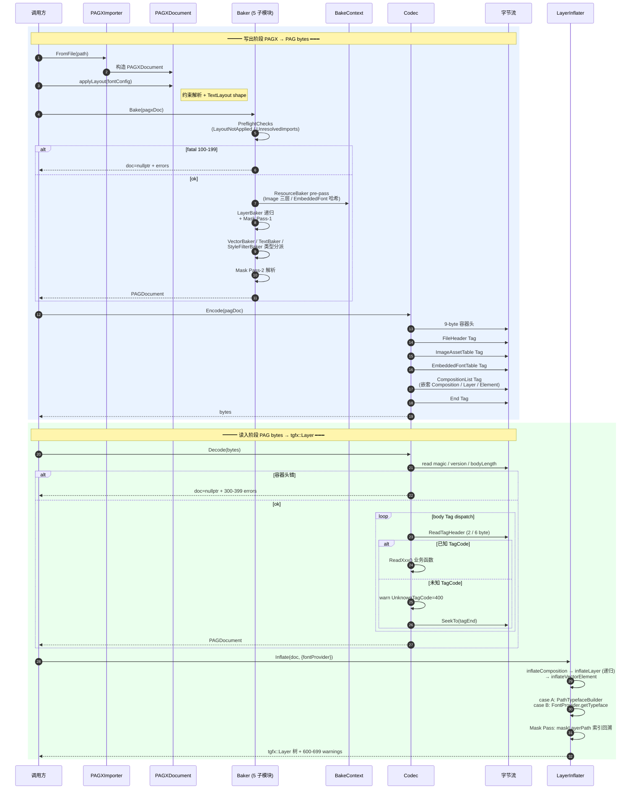

# PAGX → PAG v2 技术方案总览

> **面向对象**：项目技术决策审阅者 / Tech Lead。
> **目的**：独立阅读即能理解 PAGX→PAG v2 链路的架构取舍、数据格式、压缩与扩展性机制。
> **体例**：少而精——6 个核心决策深度展开；周边机制列举不展开。
> **权威细节**：字节级字段表 + 全部 TagCode 列表见 `docs/pagx_to_pag_v2_design.md` 附录 D / §6.1；历史演进见 `docs/pagx_to_pag_v2_changelog.md`；压缩优化备选方案见 `docs/phase20_static_compression.md`。

---

## 1. 起点：问题与约束

### 1.1 问题域

PAGX 是作者层可编辑的 XML 格式（`<Layer>` / `<Rectangle>` / `<Text>` / `<LinearGradient>` ...），包含约束布局、运行时字体解析、SVG 导入等动态能力。运行时播放需要解码成扁平的 `tgfx::Layer` 树后才能渲染。

PAG v2 是 PAGX 的**二进制产物**：

- **PAGX → PAG**（Baker + Codec::Encode）：作者一次性生成，产出静态可播放字节流
- **PAG → tgfx::Layer**（Codec::Decode + LayerInflater）：运行时快速加载，无布局解析、无字体 shape 开销

设计目标是严格"运行时等价"——PathA（PAGX 直接渲染）与 PathB（PAGX→PAG→Inflater 渲染）应像素级一致（`CrossCheck 48/48 bit-perfect`，`ComparisonDumpTest` 273/273 ok）。

### 1.2 关键约束

1. **v2 尚未对外发布**，允许 wire format 破坏性演进（FORMAT_VERSION 保持 `0x02`；Phase 16/17/18 多次变更 schema 未升版本号）
2. **与 PAG v1 codec (`src/codec/`) 并存**——v2 不替换 v1，是独立命名空间（`pagx::pag::`）
3. **v1 能力不倒退**：关键帧 / 动画曲线 / MotionPath 等高级动画预留 wire 槽位，v2 当前仅支持静态文档（encoding = Constant）
4. **设计文档权威**：`pagx_to_pag_v2_design.md` 6820 行是字节级契约的唯一真源；本文档引用之，不重复字段表

### 1.3 决策窗口

当前阶段（2026-05）：

- CrossCheck 48/48 全绿（Phase 17 case A/B 双路径 + Phase 18 TextBox inverseMatrix）
- Phase 19/20 压缩优化评估完毕，**7 个候选合计仅 ~6.6%**，均不单独启动（详见 `phase20_static_compression.md`）
- 动画扩展未启动（预留 Property encoding 1-15 / Tag 段位 160-239）

---

## 2. 六个核心决策

下列 6 个决策是 v2 架构的支柱，直接决定了性能、扩展性与失败模式。

### 2.1 决策一：Baker/Inflater 非对称 —— fatal/warn 单向流

#### 核心规则

| 环节 | 诊断范围 | fatal 行为 | warn 行为 |
|---|---|---|---|
| **Baker** (`src/pagx/pag/Baker.cpp`) | 100-299 | 返回 `doc=nullptr`，拒绝产出字节 | 产出 doc，带降级警告 |
| **Codec::Encode** | 400-499 only | 无 fatal（Baker 已门控） | 写入空字段 + warn |
| **Codec::Decode** | 300-499 | 返回 `document=nullptr` | 跳过字段，保留主干 |
| **LayerInflater** (`LayerInflater.cpp`) | 600-699 **only warn** | **不存在 fatal** | 子树/元素降级为 empty 但不丢主干 |

Inflater **没有 fatal 通道**是 v2 最重要的稳定性承诺——播放器拿到 .pag 字节永远能渲染出"至少一部分"，不会因单元素损坏整屏黑。

#### 为什么这样设计

PAG 部署场景：
- 作者端（Baker）愿意为"干净数据"付复杂校验成本（MAX_LAYER_DEPTH / MAX_GLYPHS_PER_RUN 等 10+ 上限、mask 环检查、import 解析门控）
- 播放端（Inflater）不能因一个字体缺失或 image 尺寸超限就放弃整文件——必须**失败隔离**到 Layer 粒度

这决定了两边的代码风格：

- Baker：大量 `ctx.error(code, msg)` + `return false` 的门控，失败有契约
- Inflater：大量 `ctx.warn(code, msg)` + 降级为 `tgfx::Layer::Make()` 空节点，失败被吸收

#### 诊断码段位（`include/pagx/Diagnostic.h`）

```
100-199  Baker fatal      (LayoutNotApplied=100 / UnresolvedImports=101 / StructureLimitExceeded=105 / ProducerFatal=106)
200-299  Baker warning    (ImageSourceMissing=200 / FontSourceMissing=201 / TextSelectorTypeUnsupported=209)
300-399  Codec fatal      (InvalidMagic=300 / UnsupportedVersion=301 / MalformedTag=304 / PrematureEndTag=409)
400-499  Codec warning    (UnknownTagCode=400 / UnknownPropertyEncoding=401 / InvalidEnumValue=407)
600-699  Inflater warning (InflateImageDecodeFailed=600 / TextShapingHintMiss=608 / InflaterLayerBudgetExceeded=606)
```

段位之间**永远不迁移**，段内数值**永不复用**（`TextGlyphDataEmpty=206` 已退役但 206 数值不重分配）——这是 ABI 红线。

---

### 2.2 决策二：Tag Header 紧凑格式 + "长度自描述"前向兼容

#### 字节布局（`src/pagx/pag/TagHeader.cpp`）

```
u16 codeAndLength             # high 10 bits = TagCode (0..1023)
                              # low  6 bits = length    (0..62)
[u32 extendedLength]          # 仅当 low 6 bits == 63
```

- length < 63：2 byte 头开销
- length ≥ 63：2 + 4 = 6 byte 头开销（约 90% 小 Tag 走快速通道）

#### 为什么设计成 10:6 而不是 8:8 或 varU32

- **TagCode 10 bit = 1024 槽位**：足够 v2 长期扩展（目前已定义 42 个，占 4%），且与 v1 TagHeader 字节宽度同构（v1 也是 10+6）
- **6 bit length 覆盖 90% case**：v2 Tag 体积分布——ImageAssetItem / EmbeddedFontItem 常> 63 byte 走 extended，其它 Layer/Element 小 Tag 走 2 byte 快速通道
- **不用 varU32 length**：varU32 读取成本比 u16 高 3×，且 fast path（2 byte 固定）更利 Reader 预取对齐

#### 前向兼容机制（§6.4）

Reader 碰到未知 TagCode 时：

```cpp
// Codec.cpp:197-244 主循环
uint64_t tagEnd = stream.position() + header.length;
switch (header.code) {
  case FileHeader: ReadFileHeader(...); break;
  // ...已知 Tag...
  default:
    ctx.warn(UnknownTagCode, "unknown TagCode at top level; skipped");
    break;
}
SeekTo(&stream, tagEnd);  // 无条件跳至 tagEnd，不依赖 Reader 识别
```

这让**新版 Writer 产出的文件被旧 Reader 读取时**，未知 Tag 整段跳过，已知 Tag 正常解析——所有 append-only 的新增 TagCode / Tag 内末尾追加字段都天然前向兼容。

#### 实际应用

- Phase 17 新增 `EmbeddedFontTable=8` / `EmbeddedFontItem=9`：旧 Reader warn + skip
- Phase 17 退役 `FontAssetTable=3` / `FontAssetItem=7`：TagCode 数值冻结不复用（防止 Reader 按新 schema 误读旧数据）
- Phase 18 ElementText body 尾部追加 `textBoxInverseMatrix`：通过 `if (s->position() < te) d->textBoxInverseMatrix = ReadMatrix(s);` 优雅探测

---

### 2.3 决策三：Property\<T\> + propHeader 单字节默认值短路

#### 数据模型（`src/pagx/pag/PropertyEncoding.h`）

```cpp
template <typename T>
struct Property {
  PropertyEncoding encoding = PropertyEncoding::Constant;
  T value;
};

enum class PropertyEncoding : uint8_t {
  Constant = 0,
  // 1..15 reserved for future Hold / Linear / Bezier / Spatial keyframes
};
```

#### propHeader 字节布局

```
bit 0-3  encoding   (Constant=0; 1..15 reserved)
bit 4    isDefault  (1=payload 省略,Reader 回 defaultValue)
bit 5-7  reserved   (writer 必须 0 / reader 必须忽略)
```

#### Wire 行为

静态文档（v2 当前 100%）只用 encoding=Constant：

```
WriteProperty(prop, defaultValue):
  isDefault = (value == defaultValue)
  if isDefault:
    write u8(0x10)        # 1 byte propHeader,bit 4 置位,payload 省略
  else:
    write u8(0x00)        # 1 byte propHeader
    WriteValue<T>(value)  # 完整 payload
```

全 48 sample 统计：估计 ~7,700 个 Property 字段实例，大部分命中 isDefault → 仅付 1 byte header cost（若不含此机制每字段要付 4-100 byte payload）。

#### 未来动画编码的扩展点

Property encoding 4 bit 的 1-15 槽位预留给关键帧编码：

```
1 = Hold          (无插值,整段保持起始值)
2 = Linear        (线性插值)
3 = Bezier        (三次贝塞尔,带 In/Out 控制点)
4 = Spatial       (空间轨迹,带 2D 控制点)
5..15 = reserved
```

Reader 碰到未知 encoding 时（未来老 Reader 读新动画文件）走 §4.4 规则：

```cpp
// PropertyEncoding.h:334-341
if (encoding == Constant) { /* read payload */ }
else {
  // skip 到 enclosingTagEnd,丢弃整个 Tag 剩余字段
  if (enclosingTagEnd > stream->position())
    stream->skip(enclosingTagEnd - stream->position());
  return MakeProp(defaultValue);
}
```

关键性质：**未知 encoding 不导致 fatal**，Reader 静默降级为默认值。动画字段未启动前，这个机制让老 v2 Reader 对将来的动画 .pag 保持"至少可播静态快照"。

#### 已评估但未实施的优化

**propHeader 位流压缩（Phase 20 方向 2）**：借鉴 PAG v1 `AttributeBlock`，把 N 个 Property 的 isDefault 标志打包到前置 1-bit 位流。每字段从 1 byte 降到 1 bit，全库节省 ~2.87%。因单独收益不足触发 wire bump，留给动画扩展同期落地。详见 `phase20_static_compression.md` §2。

---

### 2.4 决策四：Matrix/Color/Path 按"常见情况"分档压缩

#### Matrix 三档（`ValueCodec.h:162-213`）

```
isIdentity           → 1 byte  (header bit 0)
hasTranslateOnly     → 1 + 8 = 9 byte  (header bit 1 + tx,ty)
full 6-float         → 1 + 24 = 25 byte (header + scale/skew/trans × 2)
```

合理性：PAG 文档中绝大多数 LayerTransform / gradientMatrix / patternMatrix 是 Identity（没设置过 transform）或仅平移（layout 产生的 position 偏移）。全 6 float 仅在作者显式旋转/缩放时出现。

#### Matrix3D 两档（`ValueCodec.h:215-251`）

```
isIdentity           → 1 byte
full 4×4 float       → 1 + 64 = 65 byte
```

Matrix3D 只有 Preserve3D 的 Layer 才用，分布极度偏向 Identity，两档足够。

#### Color 4×u8 量化（`ValueCodec.h:102-116`）

```
float rgba × 4  →  u8 rgba × 4  = 4 byte
量化精度:  1/255 ≈ 0.39% per channel
```

sRGB 颜色感知精度 ~2-3% 已够，4×4=16 byte 的 float 颜色对 UI 图形完全浪费。HDR 支持路径在 spec §6.5 预留——升 FORMAT_VERSION 时切到 f32×4，不破坏 8-bit 主路径。

#### Path 当前全量（`PathCodec.cpp`）

format=0 裸 float：`u8 format + varU32 verbCount + 每 verb { u8 verbKind + 2-6 × float }`

**spec §D.2.2 format=1（动态位宽量化）设计完整但代码占位（`ChoosePathFormat` 恒返 0）**。实施触发条件是"客户提供 ≥1 MB 真实嵌入字体 .pagx"——此时压缩比 ~5×，设计不变。

---

### 2.5 决策五：资源三层去重 + EmbeddedFont 内容哈希

#### Image 三层去重（`BakeContext.h:56-58` + `ResourceBaker.cpp:8-63`）

```cpp
std::unordered_map<const void*, uint32_t>         imageIndexByNode;      // PAGX 节点指针
std::unordered_map<const tgfx::Data*, uint32_t>   imageIndexByDataPtr;   // 嵌入 Data 共享指针
std::unordered_map<std::string, uint32_t>         imageIndexByKey;       // URI / 绝对路径语义键
```

`InternAsset` 模板依次查三层：

| Tier | 命中条件 | 典型场景 |
|---|---|---|
| P1 `imageIndexByNode` | 同 PAGX 节点指针 | 同 `<Image id="logo">` 被多 `<Layer>` 引用 |
| P2 `imageIndexByDataPtr` | 不同节点共享同 tgfx::Data | 运行时构造的 PAGX 文档中,多节点持有同一 Data |
| P3 `imageIndexByKey` | URI / file path 相同 | 不同 PAGXDocument 合并时,同 URI 引用的外部文件 |

Miss 时新建 index，**逐层回填所有适用缓存**（例如 P3 命中 → 同时回填 P1/P2），让后续相同节点直接走 P1 快速通道。

#### EmbeddedFont 内容哈希去重（`BakeContext.h:69` + `TextBaker.cpp:88-146`）

```cpp
std::unordered_map<std::string, uint32_t> embeddedFontIndexByHash;

// ComputeEmbeddedFontHash:
// hash = unitsPerEm + per-glyph(advance + path verbs + path points)
```

按**内容**而不是**指针**去重——两个不同的 `pagx::Font` 节点（例如同字体子集被两个作者管线各自 emit）承载完全相同的 glyph path 时，折叠成单个 `EmbeddedFont`。

#### 为什么不做字符串池化

曾评估（Phase 19 C2）把 ShapedGlyphRun 的 typefaceFamily/Style/Key 三字段建全局 StringTable：

- 多 run 共字体场景（`rich_text.pagx` 8 run）节省 +4.6%
- **单 run 小样本反向劣化 -4% ~ -6%**（StringTable ~80 byte 固定开销 > 1 run 节省 ~34 byte，break-even = 3 run）
- 全库累积 -0.2% ~ +0.3%

结论：收益不稳定，留给未来 FormatVersion bump 搭车做。

#### Mask 两趟索引（`BakeContext.h:71-74` + `LayerBaker.cpp:91-102, 226-241`）

Mask 引用（`<Layer mask="@otherLayer">`）的特殊性：mask 目标可能在 PAGX 树中任意位置，Baker 单遍树遍历时目标可能还没 bake。两趟策略：

- Pass 1 `recordLayerPaths`：走 PAGX 树，记录 `PAGX Layer 指针 → 索引链`（e.g., `[2, 0, 1]` 表示 root.children[2].children[0].children[1]）
- Pass 2 `bakeLayerList`：解析到 mask 时查 Pass 1 map，把索引链写入 `maskLayerPath`

Inflater 端按索引链回溯查找 target Layer，mask 环由 spec §12.1 `InflateMaskCycle=607` warn 机制拦截。

---

### 2.6 决策六：Text 数据 Case A / Case B 双路径

文本是 v2 最复杂的元素——PAGX 端有 3 种数据源（作者预 shaped 的 `<GlyphRun>` / 纯 `<Text text="...">` 运行时 shape / 嵌入 `<Font>` path 资源），v2 必须无损落盘并在 Inflater 端精确复现。Phase 16（runtime shape）→ Phase 17（path-based）的架构演进后，v2 稳定在双路径架构。

#### 路径选择（`TextBaker.cpp:204-350`）

```
Case A (glyphRuns):     gate = !src.glyphRuns.empty() && anyRunHasFont
  作者预 shape + 嵌入字体 path → PAG 存 glyph IDs 和 EmbeddedFont 引用
  Inflater: PathTypefaceBuilder 回放 path,生成 TextBlob

Case B (shapedGlyphs):  gate = 上述不成立时 fallback
  Baker 跑 PAGX TextLayout 把 text 解析到 glyph IDs + positions + typeface key
  Inflater: FontProvider 查 typeface → tgfx::TextBlob::MakeFrom 回放
```

两路径**可同时出现**在同一 ElementText body（例如部分 run 有嵌入字体、部分 run 用 host font），由 boxFlags bit 7/8 分别 gate：

```cpp
// ElementTags.cpp:713-716
if (!d.glyphRuns.empty())   boxFlags |= 0x80;  // bit 7 = hasGlyphRuns
if (!d.shapedGlyphs.empty()) boxFlags |= 0x100; // bit 8 = hasShapedGlyphs
```

#### 为什么 boxFlags 扩到 u16

Phase 16.6 原本 `boxFlags` 是 `u8`（bit 0-5 已用 + bit 6 `hasShapedHint`）。Phase 17 新增两位 bit 7/8 时：

- bit 6 `hasShapedHint` 退役但**数值冻结不复用**（避免老诊断工具误读）
- `boxFlags` 扩 u8 → u16，wire 上是破坏性变更（Phase 16 文件作废）
- **扩展窗口**：v2 未发布允许此破坏，Phase 17 changelog 显式声明"旧开发分支文件需重 Bake"

#### textBoxInverseMatrix 的前向追加（Phase 18）

嵌套在 `<TextBox>` 里的 `<Text>` 有累积 Group transform。Inflater 重建 VectorGroup 时会重新套一层相同 transform，导致 Text 位移加倍。Phase 18 解决方案：

Baker 侧：
```cpp
// VectorBaker.cpp:501-523 (TextBox 识别)
if (parentIsTextBox) {
  Matrix inv;
  if (groupMatrix.invert(&inv)) {
    ctx.textBoxInverseMatrixByText[text] = inv;
  }
}

// TextBaker.cpp:356-359
auto it = ctx.textBoxInverseMatrixByText.find(&src);
data->textBoxInverseMatrix = (it != end) ? it->second : Matrix::I();
```

Wire 侧（`ElementTags.cpp:821-824`）：
```cpp
// 写入侧：无条件末尾追加
WriteMatrix(body, d.textBoxInverseMatrix);

// 读取侧：探测式读取（§6.5 字段级追加）
if (s->position() < te) {
  d->textBoxInverseMatrix = ReadMatrix(s);
}
```

Phase 17 老文件不含此字段：Reader 到达 tagEnd 自动保 `Matrix::I()` 默认值——新 Reader 读老文件降级到"无 TextBox 反向补偿"，视觉上部分 TextBox Text 会错位（已知限制），但整体文件仍可播。

---

## 3. 数据流与模块分工

### 3.1 端到端流程

```
PAGX 文件 / DOM
  ↓
[PAGXImporter::FromFile]  ← 解析 XML,构造 PAGXDocument
  ↓
[PAGXDocument::applyLayout(FontConfig)]  ← 约束解析、字体 shape、TextLayout
  ↓
[PAGExporter::ToBytes]    ← 入口 API
  ├─ Baker::Bake(pagxDoc) → PAGDocument (in-memory model)
  │   ├─ Pre-flight: hasUnresolvedImports / isLayoutApplied 门控
  │   ├─ LayerBaker    → Layer/Composition 树
  │   │   ├─ VectorBaker  → 14 种 VectorElement + TextBox 识别
  │   │   │   ├─ TextBaker       → case A / case B 双路径
  │   │   │   └─ PaintBaker      → 6 种 ColorSource + gradient stops
  │   │   └─ StyleFilterBaker → 5 Filter + 3 Style
  │   ├─ ResourceBaker → Image 三层去重 + EmbeddedFont 内容哈希去重
  │   └─ Mask Pass-1: recordLayerPaths / Pass-2: bakeLayerList
  └─ Codec::Encode(pagDoc) → byte stream
      ├─ 9 byte container header
      └─ Top-level Tag seq: FileHeader → ImageAssetTable → EmbeddedFontTable
                            → CompositionList → End
  ↓
.pag 字节流
  ↓
[PAGLoader::LoadFromFile / LoadFromBytes]
  ↓
[Codec::Decode]  → PAGDocument
  ↓
[LayerInflater::Inflate(doc, Options{fontProvider})]
  ├─ inflateComposition / inflateLayer / inflateVectorElement
  ├─ 分派到 14 种 VectorElement / 5 Filter / 3 Style
  ├─ case A: PathTypefaceBuilder + TextBlob
  ├─ case B: FontProvider.getTypeface + TextBlob
  └─ Mask Pass: 按 maskLayerPath 索引链回溯,建 Layer mask 关联
  ↓
tgfx::Layer 树（可直接交 tgfx::Surface 渲染）
```

### 3.2 目录结构

| 路径 | 内容 | 行数 |
|---|---|---|
| `src/pagx/pag/` | v2 codec + Baker/Inflater（43 个文件） | ~10,100 |
| `src/pagx/pag/PAGDocument.h` | v2 数据模型（所有 struct 权威定义） | ~750 |
| `src/pagx/pag/Baker.cpp` + `LayerBaker.cpp` + `VectorBaker.cpp` + `TextBaker.cpp` + `StyleFilterBaker.cpp` + `ResourceBaker.cpp` | Baker 6 子模块 | ~3,500 |
| `src/pagx/pag/Codec.cpp` + `CodecTags*.cpp` + `ElementTags.cpp` + `StyleFilterTags.cpp` + `PathCodec.cpp` + `PropertyEncoding.h` + `ValueCodec.h` | 编解码框架 | ~3,200 |
| `src/pagx/pag/LayerInflater.cpp` | Inflater（14×element + 5×filter + 3×style 分派） | ~1,100 |
| `src/pagx/pag/TagCode.h` + `TagHeader.cpp` + `limits.h` + `ErrorCode.h` | 元定义 | ~400 |
| `docs/pagx_to_pag_v2_design.md` | 权威字节级规格 | 6,820 |
| `test/perf/baseline.json` | 48 个 sample 的 pag 体积基准（性能回归门） | — |
| `test/src/pag/unit/ComparisonDumpTest.cpp` | PathA/PathB 并列渲染对比（273/273 ok） | ~280 |
| `test/src/pag/unit/RenderCrossCheckTest.cpp` | PSNR bit-perfect 强相等（48/48） | — |

### 3.3 模块调用时序图

下图展示一次 `PAGExporter::ToBytes` 与一次 `PAGLoader::LoadFromBytes` 的完整调用时序，重点是字节边界的产生与消费时刻。GitHub 渲染下方 mermaid 图。



**关键时序观察**：

- **Baker fatal 早期短路**（步骤 6）：document=nullptr 直接返回，`Codec::Encode` 永远不被调用
- **资源去重在 LayerBaker 之前**（步骤 9 → 10）：ResourceBaker pre-pass 让后续 LayerBaker/TextBaker 写 `imageIndex` / `embeddedFontIndex` 时直接拿到已 intern 的索引
- **Mask 两趟**（步骤 10 + 12）：PAGX 树形非时间序，mask 目标可能在 path 后才出现，必须 Pass-1 先记录所有 Layer 索引链
- **Decoder fail-soft**：未知 TagCode 不 abort，按 length skip，文件其余部分正常读
- **Inflater 无 fatal**：单元素失败降级为空 `tgfx::Layer::Make()`，主干 Layer 树永远产出

### 3.4 字节级追踪（真实样本端到端）

下面用 `spec/samples/group_isolation.pagx`（197 byte，全 48 sample 中最小且不含 image/font）做端到端字节追踪。该 sample 含 1 Composition / 1 Vector Layer / 1 VectorGroup（`alpha=0.7`）/ 1 Rectangle / 1 Ellipse / 2 Fill，能干净展示主干字节布局与 propHeader 默认值短路效果。

#### 源 PAGX

```xml
<pagx width="400" height="400">
  <Layer>
    <Group alpha="0.7">
      <Rectangle left="40" top="100" width="200" height="200" roundness="24"/>
      <Fill color="#F43F5E"/>
    </Group>
    <Ellipse left="160" top="100" width="200" height="200"/>
    <Fill color="#06B6D4"/>
  </Layer>
</pagx>
```

#### 完整 197 byte hex dump

```
offset    bytes (hex)                                          ascii
  0000:   50 41 47 02 bc 00 00 00 00 58 00 00 00 c8 43 00      PAG......X....C.
  0010:   00 c8 43 ff ff ff ff 18 00 00 00 01 00 00 00 01      ..C.............
  0020:   00 00 00 81 00 00 01 02 00 3f 01 94 00 00 00 01      .........?......
  0030:   7f 01 8d 00 00 00 00 90 01 00 00 90 01 00 00 01      ................
  0040:   bf 02 7d 00 00 00 05 00 00 00 00 00 01 00 00 00      ..}.............
  0050:   01 00 00 00 01 00 00 00 1c c5 03 10 10 10 10 10      ................
  0060:   3f 06 5c 00 00 00 03 75 0d 02 18 0a 00 00 00 0c      ?.\....u........
  0070:   43 00 00 48 43 00 00 00 48 43 00 00 48 43 00 00      C..HC...HC..HC..
  0080:   00 c0 41 00 0d 0b 09 00 00 10 03 00 00 f4 3f 5e      ..A...........?^
  0090:   ff 00 00 10 10 10 10 00 33 33 33 3f 10 10 53 0a      ........333?..S.
  00a0:   00 00 00 82 43 00 00 48 43 00 00 00 48 43 00 00      ....C..HC...HC..
  00b0:   48 43 00 0d 0b 09 00 00 10 03 00 00 06 b6 d4 ff      HC..............
  00c0:   00 00 00 00 00                                       .....
```

#### 主干字段逐段标注

> 每段格式：`[offset 范围] raw bytes — 字段名 → 含义`。下划线缩进表示嵌套层级。仅展开容器头到 LayerTransform 的主干（约前 96 byte）；其后 VectorPayload 内的 Group/Rectangle/Ellipse/Fill 字节在 `pagx_to_pag_v2_design.md` 附录 D.11 有详尽字段表。

```
=== 容器头 (9 byte) ===
[0x0000-0x0002]  50 41 47           magic         → "PAG"
[0x0003-0x0003]  02                 version       → 0x02 (FORMAT_VERSION)
[0x0004-0x0007]  bc 00 00 00        bodyLength    → 188 byte (LE u32)
[0x0008-0x0008]  00                 compression   → UNCOMPRESSED

=== FileHeader Tag (TagCode=1) — 共 26 byte (2 头 + 24 体) ===
[0x0009-0x000a]  58 00              TagHeader     → u16 0x0058 = (code=1)<<6 | length=24
[0x000b-0x000e]  00 00 c8 43        width         → 400.0f
[0x000f-0x0012]  00 00 c8 43        height        → 400.0f
[0x0013-0x0016]  ff ff ff ff        backgroundColor → 0xFFFFFFFF white opaque (RGBA u8×4)
[0x0017-0x001a]  18 00 00 00        frameRate.num → 24
[0x001b-0x001e]  01 00 00 00        frameRate.den → 1   (24/1 fps)
[0x001f-0x0022]  01 00 00 00        duration      → 1 帧

=== ImageAssetTable Tag (TagCode=2) — 共 3 byte ===
[0x0023-0x0024]  81 00              TagHeader     → u16 0x0081 = (code=2)<<6 | length=1
[0x0025-0x0025]  00                 count         → 0 (varU32)

=== EmbeddedFontTable Tag (TagCode=8) — 共 3 byte ===
[0x0026-0x0027]  01 02              TagHeader     → u16 0x0201 = (code=8)<<6 | length=1
[0x0028-0x0028]  00                 count         → 0 (varU32)

=== CompositionList Tag (TagCode=4) — 共 154 byte (6 头 + 148 体) ===
[0x0029-0x002a]  3f 01              codeAndLength → u16 0x013F = (code=4)<<6 | length=63 (溢出)
[0x002b-0x002e]  94 00 00 00        extendedLength→ 148
[0x002f-0x002f]  01                 count         → 1 (varU32)

  --- 嵌套 Composition Tag (TagCode=5) — 共 147 byte (6 头 + 141 体) ---
  [0x0030-0x0031]  7f 01            codeAndLength → u16 0x017F = (code=5)<<6 | length=63
  [0x0032-0x0035]  8d 00 00 00      extendedLength→ 141
  [0x0036-0x0036]  00               id length     → 0 (隐式根 composition,匿名)
  [0x0037-0x003a]  90 01 00 00      width         → 400 (u32 — composition canvas)
  [0x003b-0x003e]  90 01 00 00      height        → 400
  [0x003f-0x003f]  01               layerCount    → 1 (varU32)

    --- 嵌套 LayerBlock Tag (TagCode=10) — 共 131 byte (6 头 + 125 体) ---
    [0x0040-0x0041]  bf 02          codeAndLength → u16 0x02BF = (code=10)<<6 | length=63
    [0x0042-0x0045]  7d 00 00 00    extendedLength→ 125
    [0x0046-0x0046]  05             type          → 5 = LayerType::Vector
    [0x0047-0x0047]  00             name length   → 0 (匿名 Layer)
    [0x0048-0x004b]  00 00 00 00    startTime     → 0   ← Phase 20 候选优化:静态层省 16 byte
    [0x004c-0x004f]  01 00 00 00    duration      → 1
    [0x0050-0x0053]  01 00 00 00    stretch.num   → 1
    [0x0054-0x0057]  01 00 00 00    stretch.den   → 1   (1:1 静态层)
    [0x0058-0x0058]  1c             layerFlags    → 0x1C = bit2 PassThroughBackground +
                                                          bit3 AllowsEdgeAA +
                                                          bit4 AllowsGroupOpacity

      --- 嵌套 LayerTransform Tag (TagCode=15) — 共 7 byte (2 头 + 5 体) ---
      [0x0059-0x005a]  c5 03        TagHeader     → u16 0x03C5 = (code=15)<<6 | length=5
      [0x005b-0x005b]  10           propHeader#1  → visible.isDefault=1 (true)  ★
      [0x005c-0x005c]  10           propHeader#2  → alpha.isDefault=1 (1.0)     ★
      [0x005d-0x005d]  10           propHeader#3  → blendMode.isDefault=1 (Normal) ★
      [0x005e-0x005e]  10           propHeader#4  → matrix.isDefault=1 (Identity)  ★
      [0x005f-0x005f]  10           propHeader#5  → matrix3D.isDefault=1 (Identity)★

    --- 嵌套 VectorPayload Tag (TagCode=24) — 共 98 byte (6 头 + 92 体) ---
    [0x0060-0x0061]  3f 06          codeAndLength → u16 0x063F = (code=24)<<6 | length=63
    [0x0062-0x0065]  5c 00 00 00    extendedLength→ 92
    [0x0066-0x0066]  03             element count → 3 (Group / Ellipse / Fill)

    --- 之后 92 byte 是 3 个 VectorElement,详见 spec §D.11 ---
    --- 0x0067 起: ElementVectorGroup α=0.7 / Ellipse / Fill ---

=== End Tag (TagCode=0) ===
[0x00C1-0x00C2]  00 00              TagHeader     → u16 0x0000 = (code=0)<<6 | length=0
[0x00C3-0x00C4]  00 00              padding (4 byte 对齐残留,不在 bodyLength 内)
```

#### 关键观察

1. **★ 标记的 5 个 `0x10` 字节** 在 `LayerTransform` 内是**最直观的压缩展示**：5 个 Property（visible / alpha / blendMode / matrix / matrix3D）全部命中默认值，**5 byte 替代了 (1+1) + (1+4) + (1+1) + (1+25) + (1+65) = 101 byte 的"完整写法"**——压缩比 ~20×。这是「决策三 propHeader 默认值短路」的实际兑现。

2. **TagHeader 紧凑格式**的"小 Tag 走 2 byte / 大 Tag 走 6 byte"在样本里都出现：FileHeader/ImageAssetTable/EmbeddedFontTable/LayerTransform 都是 2 byte 头；CompositionList/Composition/LayerBlock/VectorPayload 都因 length ≥ 63 走 6 byte 扩展头（length 字段 = 63 触发后跟 u32）。

3. **Layer 静态时间字段** `startTime/duration/stretch.num/stretch.den` 共 16 byte（offset 0x48-0x57）全是 hard-coded `0/1/1/1`——是 Phase 20 方向 1 待启动优化的目标，可改 1 byte isStatic 标志省 15 byte/Layer。

4. **顶层 Tag 顺序固定**：FileHeader → ImageAssetTable → EmbeddedFontTable → CompositionList → End，由 `Codec.cpp:44-56` 强制（spec §6.2）。Reader 不依赖此顺序（按 TagCode dispatch），但 Writer 必须保持，便于 Reader 早期校验。

5. **嵌套结构靠 Tag length 自隔离**：CompositionList(154) 内 Composition(147) 内 LayerBlock(131) 内 LayerTransform(7) + VectorPayload(98)——每层都用自己的 length 边界，未知子 Tag 可被任意层 skip 不影响外层。

#### 体积构成

将 197 byte 按功能归类：

| 组成 | 字节数 | 占比 |
|---|---|---|
| 容器头 (`PAG` magic + version + bodyLength + compression) | 9 | 4.6% |
| FileHeader Tag（含 TagHeader + body） | 26 | 13.2% |
| 资源表（ImageAssetTable + EmbeddedFontTable，全空） | 6 | 3.0% |
| Tag 头开销（CompositionList/Composition/LayerBlock 三层 6-byte ext-header + VectorPayload） | 24 | 12.2% |
| Composition body 元字段（id/w/h/layerCount） | 10 | 5.1% |
| Layer body 元字段（type/name/timing/flags） | 19 | 9.6% |
| LayerTransform 体（5 byte，全默认） | 5 | 2.5% |
| VectorPayload + 3 VectorElement bodies | 95 | 48.2% |
| End Tag + 对齐残留 | ~3 | 1.5% |

可见**实际有内容的图形数据仅占 48%**，元字段+Tag 头共 ~52%。这反映了 v2 是为大文档优化（资源池 / Composition 复用 / 深嵌套 Layer 树），小样本的 Tag 头开销占比偏高——但对 ≥ 1 KB 的真实文档，相对开销迅速下降到 < 10%。

---

## 4. Tag 注册表（已定义 42 个）

### 4.1 段位布局（`TagCode.h:3-17`）

```
0          End / 流终止符
1-9        Top-level(7 used, 2 retired)
10-19      Layer 块 + 子 Tag (5 used)
20-39      Payload (7 used)
40-119     VectorElement (14 used; 40-53)
120-139    LayerFilter (5 used)
140-159    LayerStyle (3 used)
160-239    Animation (0 used, 全预留给关键帧/插值曲线/RangeSelector v2)
900-1021   实验/第三方 (0 used, 16-byte UUID 前缀的 vendor 扩展)
1022       ErrorMarker (Baker fatal 流终止哨兵; spec 已定义,代码未连通)
1023       reserved
```

**设计意图**：每段 50% 预留。当前占用率 ~4%（42/1024），v2 长期扩展空间充裕。Phase 17 新增 EmbeddedFontTable=8 / EmbeddedFontItem=9 填满了 Top-level 段位的剩余空位；未来新增顶层资源需要评估段位扩张（例如 Phase 20 方向 2 `StringTable` 考虑占 11，`1-9 top-level` 扩到 `1-11 top-level`）。

### 4.2 TagCode 完整清单

| Code | 名称 | 作用 | Phase |
|---|---|---|---|
| 0 | End | 流终止 | v2 初始 |
| 1 | FileHeader | width/height/bgColor/frameRate/duration | v2 初始 |
| 2 | ImageAssetTable | 全部 ImageAsset 资源表 | v2 初始 |
| ~~3~~ | ~~FontAssetTable~~ | 已退役（Phase 16 v2.20） | retired |
| 4 | CompositionList | 所有 Composition 容器 | v2 初始 |
| 5 | Composition | 单个 Composition + 其 Layer 列表 | v2 初始 |
| 6 | ImageAssetItem | 单个 Image 资源项 | v2 初始 |
| ~~7~~ | ~~FontAssetItem~~ | 已退役（Phase 16 v2.20） | retired |
| 8 | EmbeddedFontTable | 嵌入字体 path 资源表 | Phase 17 v2.23 |
| 9 | EmbeddedFontItem | 单个 EmbeddedFont（unitsPerEm + glyph path × N） | Phase 17 v2.23 |
| 10 | LayerBlock | Layer 节点 + 递归 children | v2 初始 |
| 12 | LayerMaskRef | Layer 的 mask 引用链 | v2 初始 |
| 13 | LayerFilters | Layer 的 filter 列表 | v2 初始 |
| 14 | LayerStyles | Layer 的 style 列表 | v2 初始 |
| 15 | LayerTransform | visible/alpha/blendMode/matrix/matrix3D/scrollRect | v2 初始 |
| 20-26 | 7 种 Payload | Shape/Text/Image/Solid/Vector/Mesh/CompositionRef | v2 初始 |
| 40-53 | 14 种 VectorElement | Rectangle/Ellipse/Polystar/ShapePath/FillStyle/StrokeStyle/TrimPath/RoundCorner/MergePath/Repeater/Text/TextPath/TextModifier/VectorGroup | v2 初始 |
| 120-124 | 5 种 Filter | Blur/DropShadow/InnerShadow/ColorMatrix/Blend | v2 初始 |
| 140-142 | 3 种 Style | DropShadow/InnerShadow/BackgroundBlur | v2 初始 |
| 1022 | ErrorMarker | Baker fatal 流终止（当前未连通） | spec §8.3ter |

---

## 5. 压缩机制全景

### 5.1 已生效的压缩

| 机制 | 位置 | 典型节省 | 说明 |
|---|---|---|---|
| **TagHeader 10+6 位打包** | `TagHeader.cpp` | 每 Tag 头 2 byte（> 63B 时 6 byte） | 90% 小 Tag 走 2 byte 快速通道 |
| **Property isDefault 短路** | `PropertyEncoding.h:307-319` | 默认值省整个 payload（4-100 byte → 1 byte header） | 全库 Property 字段约 60% 命中默认 |
| **Matrix 三档 1/9/25** | `ValueCodec.h:162-213` | Identity 省 24 byte / 仅平移省 16 byte | LayerTransform.matrix 绝大多数 Identity |
| **Matrix3D 两档 1/65** | `ValueCodec.h:215-251` | Identity 省 64 byte | 仅 Preserve3D Layer 用 |
| **Color u8×4 量化** | `ValueCodec.h:102-116` | 16 byte float → 4 byte u8 | 精度 1/255 对 sRGB 足够 |
| **ULEB128 varU32** | `writeEncodedUint32` | 小计数 1-2 byte（vs 定长 4 byte） | 用于 count/list-length 字段 |
| **Image 三层去重** | `BakeContext.h + ResourceBaker.cpp` | 重复引用的 image 只存一份 bytes | Layer / node / URI 三种共享场景 |
| **EmbeddedFont 内容哈希去重** | `TextBaker.cpp:88-146` | 结构相同的字体子集折叠为一份 | 多管线生成的重复子集 |
| **前向兼容 unknown skip** | `Codec.cpp + PropertyEncoding.h` | 未知 Tag / encoding 占原本字节数跳过 | 扩展时老 Reader 无需改动 |

### 5.2 评估过未启动的压缩（详见 `phase20_static_compression.md`）

| 候选 | 预期全库收益 | 被否决原因 |
|---|---|---|
| Layer 静态时间字段省略 | ~3.7% | 单独收益不够触发 wire bump,待动画引入同期做 |
| Property propHeader 位流 | ~2.9% | 同上,V1 AttributeBlock 机制借鉴 |
| StringTable typeface×3 池化 | -0.2% ~ +0.3% | 小样本反向劣化（break-even 阈值不达标） |
| Path format=1 量化 | 2.4% 全库 / 50%+ EmbeddedFont | 当前 sample 无大字体,客户真实场景再启动 |
| 10 处 count 字段 u32→varU32 | 0.16% | 收益过低 |
| Gradient stopPositions u8 量化 | ~0.5% | 引入精度不一致,留给 ColorStopV2 |
| compositionIndex varU32 | ~0.1% | 收益过低 |

总结：现有 7 个已生效压缩机制把 v2 格式压到接近结构性下限，新增候选单独做均不值。未来策略是**组合实施**——下次 FORMAT_VERSION bump 或动画引入时一次性落地多项，摊薄 wire 不兼容变更的文档同步成本。

---

## 6. 扩展性承诺

### 6.1 spec §6.5 兼容性两级

| 级别 | 适用场景 | 实现方式 | Reader 行为 |
|---|---|---|---|
| **① 字段级追加** | 新字段添到 Tag body 末尾；新增 TagCode；新增 enum 值 | append-only（例：Phase 18 textBoxInverseMatrix） | 未知字节按 length skip，老字段行为不变 |
| **② FORMAT_VERSION bump** | 容器头变更 / 现有字段字节格式不兼容 / 必选 top-level 变更 | magic/version/必选 Tag 变更 | 老 Reader 见新版本号 graceful reject |

v2 当前仍在**发布前破坏窗口期**——任何 schema 变更都可保持 FORMAT_VERSION=0x02 并要求旧分支文件重 Bake（Phase 16/17/18 均使用此特权）。发布后必须严守 §6.5 规则。

### 6.2 预留扩展槽位

- **TagCode 段位 160-239**（80 个槽位）：关键帧 / 插值曲线 / RangeSelector v2 / MotionPath
- **Property encoding 1-15**（15 个槽位）：Hold / Linear / Bezier / Spatial
- **layerFlags bit 5-7 reserved**：未来 Layer 新 bool 开关
- **propHeader bit 5-7 reserved**：动画相关标志位
- **boxFlags bit 9-15 reserved**：Text 新字段 gate

### 6.3 ABI 红线

- `DiagnosticCode` 数值段内追加，**永不跨段迁移**，**永不复用退役数值**（`TextGlyphDataEmpty=206` / `FontAssetTable=3` / `FontAssetItem=7` 均冻结）
- 必选 top-level Tag（FileHeader / ImageAssetTable / CompositionList / Composition / LayerBlock）五者缺失 = 文件不可播，**字段不兼容变更必须升 FORMAT_VERSION**
- Property<T> `defaultValue` 必须在 `MakeProp(X)` initializer 中集中定义，不允许在 Codec / Baker / Inflater 中重复 hardcode（§C.2）

---

## 7. 限制与已知盲区

### 7.1 已知不支持

- **动画**：关键帧 / 插值曲线 / MotionPath / Expression 全部预留未启动（Tag 段位 160-239 / Property encoding 1-15）
- **HDR / Wide-gamut 颜色**：当前 Color 固定 u8×4 sRGB，升级需升 FORMAT_VERSION（§6.5 ②）
- **SVG 导入**：PAGX 的 `<svg>` / `import="*.svg"` 必须经 `pagx resolve` CLI 转成 PAGX 原生节点，否则 `Baker.cpp:28-32` 触发 `UnresolvedImports=101`

### 7.2 运行时限制（`src/pagx/pag/limits.h`）

```
MAX_TOTAL_BODY_BYTES       = 1 GB
MAX_IMAGE_BYTES            = 100 MB / image
MAX_FONT_BYTES             = 50 MB / font
MAX_IMAGES                 = 10,000
MAX_FONTS                  = 1,000
MAX_LAYER_DEPTH            = 64
MAX_LAYERS_PER_COMPOSITION = 10,000
MAX_COMPOSITIONS           = 1,000
MAX_CANVAS_DIM             = 16,384
MAX_PATH_VERBS             = 100,000
MAX_GLYPHS_PER_RUN         = 100,000
MAX_GRADIENT_STOPS         = 256
MAX_FILTERS_PER_LAYER      = 64
MAX_STYLES_PER_LAYER       = 64
MAX_VECTOR_ELEMENTS_PER_PAYLOAD = 100,000
MAX_VECTOR_ELEMENT_DEPTH   = 64
MAX_COMPOSITION_REF_DEPTH  = 32
MAX_INFLATED_LAYER_COUNT   = 1,000,000 (Inflater 累计预算)
```

超限：Baker 侧 `StructureLimitExceeded=105` fatal，Inflater 侧 `InflaterLayerBudgetExceeded=606` warn + 降级。

### 7.3 测试覆盖盲区

- **`test/perf/baseline.json`** 仅 48 个 sample / 共 230 KB，不覆盖大字体 / 大图 / 深度嵌套 / 长动画等生产典型场景
- **`ComparisonDumpTest`** 渲染 273 sample（排除 6 个 `pagx resolve` CLI fixture），但只比对**可渲染正确性**，不比对字节结构
- **Fuzzing**（`cmake-build-fuzz`）覆盖 Codec 解码入口的恶意输入，不覆盖 Baker 生成链

---

## 8. 演进路线图（建议）

### 8.1 近期（无外部依赖）

- **动画基础能力**：Property encoding 1-3（Hold/Linear/Bezier）落地 → TagCode 160-169（关键帧容器）→ Inflater 时间轴播放
- **文档对外发布**：明确"v2 锁定"时间点，之后启用 §6.5 兼容性规则（不再允许不升 FORMAT_VERSION 的 schema 破坏）

### 8.2 中期（性能/体积客户提出时）

- **Phase 20 组合压缩**（`phase20_static_compression.md`）：Layer 静态时间 + Property propHeader 位流 ≈ 6.6%，搭车动画引入或下次 FORMAT_VERSION bump
- **Path format=1 量化**（spec §D.2.2）：客户提供 ≥1 MB 真实嵌入字体 .pagx 时启动，预期 50%+ 压缩

### 8.3 远期（生态扩展）

- **第三方 Tag 区 900-1021**：16-byte UUID 前缀的 vendor 扩展（spec §6.1 已定义，代码未连通）
- **顶层压缩**：容器头 compression byte 启用 zlib/lz4（当前固定 0x00，字段预留）
- **HDR 颜色路径**：升 FORMAT_VERSION 到 0x03，Color 切 f32×4

---

## 附录 A：关键文件引用表

| 文件 | 关键函数 | 行号 |
|---|---|---|
| `Baker.cpp` | `Bake()` | 38 |
| `LayerBaker.cpp` | `BakeAllLayers() / bakeLayer()` | 265, 177 |
| `VectorBaker.cpp` | `BakeVectorPayload() / BakeElement()` | 545, 100 |
| `TextBaker.cpp` | `BakeText()` (case A 204 / case B 247) / `ComputeEmbeddedFontHash()` | 181, 88 |
| `StyleFilterBaker.cpp` | `BakeLayerFilters() / BakeLayerStyles()` | 130, 151 |
| `ResourceBaker.cpp` | `RegisterImage() / InternAsset()` | 67, 8 |
| `Codec.cpp` | `Encode() / Decode()` | 38, 76 |
| `LayerInflater.cpp` | `Inflate() / inflateLayer()` | 53(header), 126 |
| `PropertyEncoding.h` | `WriteProperty<T>() / ReadProperty<T>()` | 307, 322 |
| `ValueCodec.h` | `WriteMatrix() / WriteColor()` | 162, 102 |
| `PathCodec.cpp` | `WritePath() / ReadPath()` | 62, 134 |
| `TagHeader.cpp` | `ReadTagHeader() / WriteTagHeader()` | 6, 19 |
| `ElementTags.cpp` | `WriteElementTextBody() / ReadElementTextBody()` | 683, 827 |

## 附录 B：术语表

| 术语 | 定义 |
|---|---|
| **PAGX** | 作者层可编辑 XML 格式 |
| **PAG v2** | PAGX 的二进制产物 |
| **Baker** | PAGX → PAGDocument（in-memory model） |
| **Codec** | PAGDocument ↔ byte stream |
| **Inflater** | PAGDocument → tgfx::Layer 树 |
| **Property\<T\>** | 带 encoding 标识的字段容器，未来支持关键帧 |
| **propHeader** | 1 byte 元数据（encoding + isDefault + reserved） |
| **TagHeader** | 2-6 byte（code:10 + length:6 + 可选 extLen:32） |
| **case A (glyphRuns)** | 作者预 shape glyph IDs + 嵌入字体 path |
| **case B (shapedGlyphs)** | Baker 运行时 shape + FontProvider 回放 |
| **InternAsset** | 资源去重 helper（三层 Image / 哈希 EmbeddedFont） |

## 附录 C：相关文档

- `docs/pagx_to_pag_v2_design.md` — 字节级权威规格（6820 行）
- `docs/pagx_to_pag_v2_changelog.md` — 全部 schema 演进历史
- `docs/phase20_static_compression.md` — 已评估未启动的压缩优化设计存档
- `docs/development_plan.md` — 长期开发路线图

---

**版本**：2026-05-11 撰写
**提交点**：`feature/henryjpxie_pagx_pag` HEAD（含 Phase 17/18 全部功能 + ComparisonDumpTest 273/273 ok）
